Four growing villains that are challenging our capacity to think, focus, learn, grow,
and be fully human.

1. **Digital deluge:** The unending flood of information in a world of
finite time and unfair expectations that leads to overwhelm, anxiety, and
sleeplessness. Drowning in data and rapid change, we long for strategies and
tools to regain some semblance of productivity, performance, and peace of mind.
2. **Digital distraction:** The fleeting() ping of digital dopamine
pleasure replaces our ability to sustain the attention necessary for deep
relationship, deep learning, or deep work. I recently sat next to a friend at a
lecture and noticed her picking up her phone multiple times within a few
minutes. I asked for her phone and pulled up the screen time app. She had picked
up her phone more than one thousand times and had one thousand notifications
in one day. Texts, social media notifications, e-mails, and news alerts, while
important in context, can derail our concentration and train us to be distracted
from what matters most in the moment.
3. **Digital dementia:** Memory is a muscle that we have allowed to atrophy. While there are benefits to having a supercomputer in your pocket,think of it like an electric bicycle. It’s fun and easy but doesn’t get you in shape. Research on dementia proves that the greater our capacity to learn—the more mental “brainercise” we perform—the lower our risk of dementia. In many cases, we have outsourced our memory to our detriment.
4. **Digital deduction:** In a world where
information is abundantly accessible, we’ve perhaps gone too far in how we use
that information, even getting to the point where we are letting technology do
much of our critical thinking and reasoning for us. Online, there are so many
conclusions being drawn by others that we have begun to surrender our own
ability to draw conclusions. We would never let another person do our thinking
for us, but we’ve gotten far too comfortable with letting devices have that very
power.
The cumulative effects of these four digital villains robs us of our focus,
attention, learning, and, most importantly, our ability to truly think. It robs us of
our mental clarity and results in brain fatigue, distraction, inability to easily
learn, and unhappiness. While the technological advances of our time have the
potential to both help and harm, the way we use them in our society can lead to
an epidemic of overload, memory loss, distraction, and dependency. And it’s
only going to get worse.

### Secret to limitless life

- **Limitless beliefs:** If our mindset is not aligned with our desires or goals, we will never achieve them. It’s critical to identify your limiting beliefs, stories, and deeply held
beliefs, attitudes, and assumptions about yourself and what’s possible.
Examining, excavating, and expunging those beliefs is the first step to having a
limitless mindset. I was told I could do anything by my mother, that I was smart,
capable, and could be the best at anything I tried. That deeply held belief
allowed me to succeed beyond my wildest dreams. But I also had the belief that
relationships were hard and filled with pain and drama from witnessing my
parents’ divorce and marriages. It took me nearly 50 years to erase that belief
and find real happiness in my marriage.
- **Motivation:** Jim outlines three key
elements to motivation. First, your purpose. The reason why matters. I want to
age well and am committed to lifting weights and getting stronger even though it
is not my favorite thing to do. The purpose supersedes the discomfort.
The second key is the ability to do what you want. This requires energy, and
energy requires something called energy management. The science of human
performance is critical to achieving your purpose—eating whole unprocessed
food, exercise, stress management, quality sleep, and skills at communication
and building healthy relationships (and eliminating toxic ones). And lastly the
tasks must be bite-size, small steps that lead to success. Floss one tooth, read one
page of a book, do one push-up, meditate for one minute, all of which will lead
to confidence, and ultimately bigger successes.
- **Method:** We have been taught
19th- and 20th-century tools for functioning in the 21st century. Limitless
teaches us the five key methods to achieve whatever we want: Focus, Study,
Memory Enhancement, Speed Reading, and Critical Thinking. Using these
upgraded learning technologies allows us to harness our mindset and motivation
to more easily and effectively reach our dreams.

---
# Limitless Model

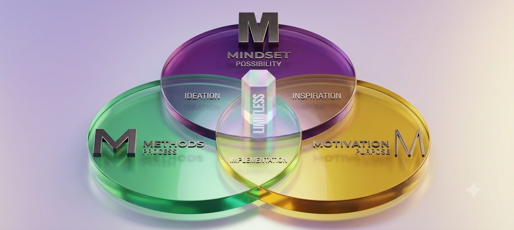

You can learn to be, do, have, and share with no constraints. I wrote this book to
prove this to you. If you are not learning or living at your full potential, if there
is a gap between your current reality and your desired reality, here’s the reason:
There is a limit that must be released and replaced in one of three areas:
- A limit in your Mindset—you entertain a low belief in yourself, your capabilities, what you deserve, or what is possible.
- A limit in your Motivation—you lack the drive, purpose, or energy to take action.
- A limit in your Methods—you were taught and are acting on a process that is not effective to create the results you desire.

This applies to an individual, a family, an organization. We all have our own
unique story of struggles and strengths. Whatever your situation happens to be,
here’s the best part: You’re not alone. I’m going to help you become limitless in
your own way, within the three-part framework you’re about to learn: Limitless
Mindset, Limitless Motivation, and Limitless Methods. Let me break it down:
- Mindset (the WHAT): deeply held beliefs, attitudes, and assumptions we
create about who we are, how the world works, what we are capable of and
deserve, and what is possible.
- Motivation (the WHY): the purpose one has for taking action. The energy
required for someone to behave in a particular way.
- Method (the HOW): a specific process for accomplishing something,
especially an orderly, logical, or systematic way of instruction.

One other note about the diagram on the previous page. You’ll see that where
mindset crosses over with motivation, I have the word inspiration. You’re
inspired, but you don’t know which methods to employ or where to channel your
energy. Where motivation and method intersect, you have implementation. In
this case, your results are going to be limited to what you feel you deserve, what
you feel you are capable of, and what you believe is possible because you lack
the proper mindset. Where mindset and method intersect, you have ideation.
Your ambitions stay in your mind, because you lack the energy to do anything
about them. Where all three intersect, you have the limitless state. You then have
the fourth I, which is integration.

Throughout this book, you’ll find exercises, studies, mental tools, and the
results of exciting work being done both on the frontier of cognitive science and
performance as well as ancient wisdom (for example, how ancient civilizations
remembered generations of knowledge before external storage devices like the
printing press). We’ll approach the 3 M’s in turn:

- In `Part II`, Limitless Mindset, you’ll learn what is possible when you eradicate limiting beliefs.
- In `Part III`, Limitless Motivation, you’ll discover why your purpose is your power and keys to unleash your drive and energy.
- In `Part IV`, Limitless Methods, you’ll discover how to learn at your best with proven processes—the tools and techniques that will propel you forward toward the life you desire and deserve.

> **Kwik start**

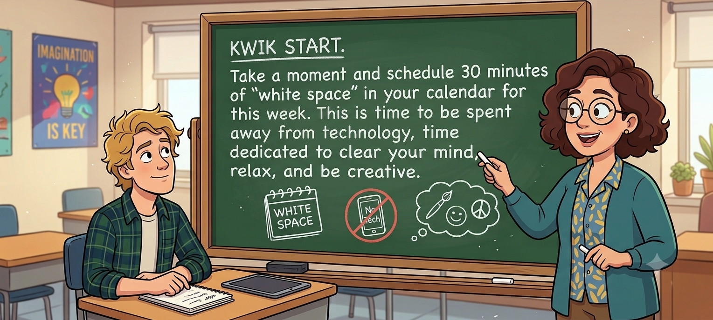

> [!NOTE]
> **The Organized Mind: Thinking Straight in the Age of Information Overload** by *Daniel Levitin*

> **Kwik start**

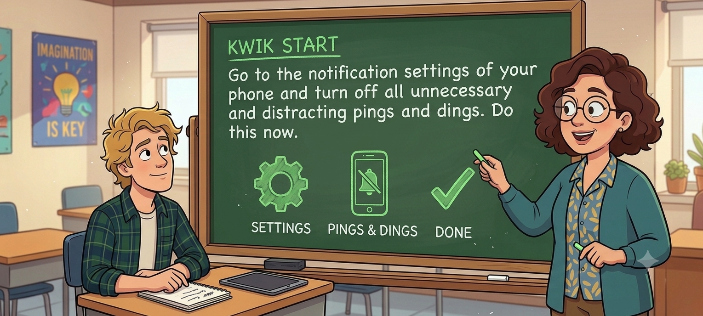

> **Kwik start**

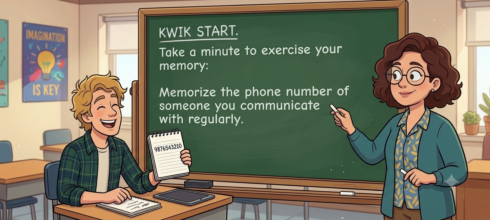

> Kwik start

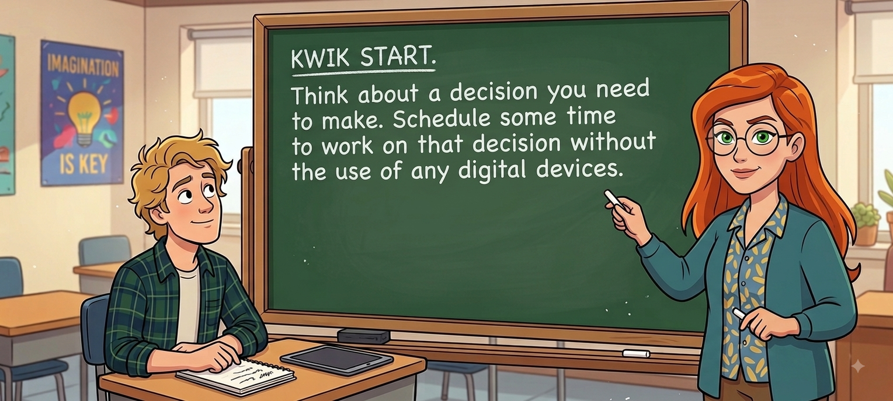

> [!TIP]
> Those who help point out the personal weaknesses we need to address. That is where your opportunity lies.

> Kwik start

# Understanding Neuroplasicity

What can we learn from the brains of London taxicab drivers?
This is the question neuroscientist Eleanor Maguire of University College
London posed as she considered the vast amount of information held in the
brains of the city’s cab drivers, appropriately called “The Knowledge.” To earn
their licenses, applicants traveled by moped through a specific section of the city
—a 10-kilometer radius of Charing Cross station—for three to four years,
memorizing the maze of 25,000 streets within as well as the thousands of attractions they supported. Even after this intense study, only about 50 percent of
applicants pass the series of licensing exams. Perhaps, thought Maguire, those
successful had larger than average hippocampi.
Maguire and her colleagues discovered that London taxi drivers did indeed
have “more gray matter in their posterior hippocampi than people who were
similar in age, education, and intelligence who did not drive taxis. In other
words, taxi drivers had plumper memory centers than their peers. It seemed that
the longer someone had been driving a taxi, the larger his hippocampus, as
though the brain expanded to accommodate the cognitive demands of navigating
London’s streets.”
The London Taxi Cab Study provides a compelling example of the brain’s
neuroplasticity, or ability to reorganize and transform itself as it is exposed to
learning and new experiences. Having to constantly learn new routes in the city
forced the taxi cab drivers’ brains to create new neural pathways. These
pathways changed the structure and size of the brain, an amazing example of the
limitless brain at work.
Neuroplasticity, also referred to as brain plasticity, means that every time you
learn something new, your brain makes a new synaptic connection. And each
time this happens, your brain physically changes–it upgrades its hardware to
reflect a new level of the mind.
Neuroplasticity is dependent on the ability of our neurons to grow and make
connections with other neurons in other parts of the brain. It works by making
new connections and strengthening (or weakening, as the case may be) old ties. Our brain is malleable. We have the incredible ability to change its structure
and organization over time by forming new neural pathways as we experience,
learn something new, and adapt. Neuroplasticity helps explain how anything is
possible. Researchers hold that all brains are flexible in that the complex webs of
connected neurons can be rewired to form new connections. Sometimes, that
means the brain compensates for something it has lost, as when one hemisphere
learns to function for both. Just as there are people who have suffered strokes
and have been able to rebuild and regain their brain functions, those that procrastinate, think excessive negative thoughts, or can’t stop eating junk food
may also rewire and change their behaviors and transform their lives.
If learning is making new connections, then remembering is maintaining and
sustaining those connections. When we struggle with memory or experience
memory impairment, we are likely experiencing a disconnection between
neurons. In learning, when you fail to remember something, view it as a failure
to make a connection between what you’ve learned and what you already know, and with how you will use it in life.
For example, if you feel that something you’ve learned is valuable in the
moment, but that you’ll never use it again, you are unlikely to create a memory
of it. Similarly, if you learn something but have no higher reasoning as to why
it’s important to you or how it applies to your life or work, then it’s likely that
your brain will not retain the information. It’s totally normal to have a memory
lapse—we’re human, not robots. But if we respond to this lapse in memory with
the attitude that “I have a bad memory,” or “I’m not smart enough to remember
this,” then we negatively affect our ability to learn and grow. In other words, the
belief we might develop in response to forgetting does far more damage than the
lapse in memory. That kind of self-talk reinforces a limiting belief, rather than
acknowledging the mistake and reacquiring the information.
What does this mean for learning? Plasticity means that you can mold and
shape your brain to suit your desires. That something like your memory is
trainable—when you know how to help your brain receive, encode, process, and
consolidate information. It means that with a few simple changes to something
like your environment, your food, or your exercise, you can dramatically change
the way your brain functions. I will share these energy tips in detail in Chapter 8.
Here’s the bottom line: Plasticity means that your learning, and indeed your
life, is not fixed. You can be, do, have, and share anything when you optimize
and rewire your brain. There are no limitations when you align and apply the
right mindset, motivation, and methods.

# How to read and remember this book or any book?

Your time is one of your greatest assets. It’s the one thing you can’t get back.
As your brain coach, I want you to get the greatest results and return on your
attention, so here are some recommendations on how to get the most out of this
book. You can apply this advice toward practically anything you want to learn
and read.
Let’s start with a question: Have you ever read something only to forget it the
next day?
You are not alone. Psychologists refer to this as the “forgetting curve.” It is
the mathematical formula that describes the rate at which information is
forgotten after it is initially learned. Research suggests humans forget
approximately 50 percent of what they learn within an hour, and an average of
70 percent within 24 hours. Below are a handful of recommendations that will help you stay ahead of the
curve. Later, I will share advanced strategies to accelerate your learning and
retention in the sections on study, speed-reading, and memory improvement.

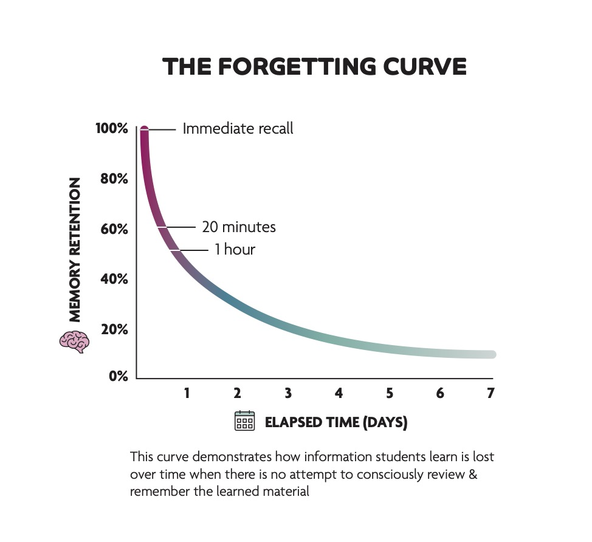

Research suggests that our natural ability to concentrate wanes between 10 to
40 minutes. If we spend any longer on a given task, we get diminishing returns
on our investment of time because our attention starts to wander. For that reason,
I suggest you use the Pomodoro technique, a productivity method developed by
Francesco Cirillo based on the idea that the optimal time for a task is 25 minutes,
followed by a 5-minute break.
2 Each 25-minute chunk is called a “Pomodoro.”
As you read this book, I suggest that you read for one Pomodoro and then take a
5-minute brain break before continuing.
When it comes to learning, the Pomodoro technique works for reasons related
to memory, specifically the effect of primacy and recency.
The effect of primacy is that you’re more likely to remember what you learn
in the beginning of a learning session, a class, a presentation, or even a social
interaction. If you go to a party, you might meet 30 strangers. You’re most likely
to remember the first few people that you meet (unless you’ve been trained to
remember names with my method, which I’ll teach you later in this book).
The effect of recency is that you’re also likely to remember the last thing you
learned (more recent). At the same party, this means that you’ll remember the
names of the last few people you met.
We’ve all procrastinated before a test and then, the night before the exam, sat
down to “cram” as much as possible without any breaks. Primacy and recency
are just two of the (many) reasons cram sessions don’t work. But by taking
breaks, you create more beginnings and endings, and you retain far more of what
you’re learning.

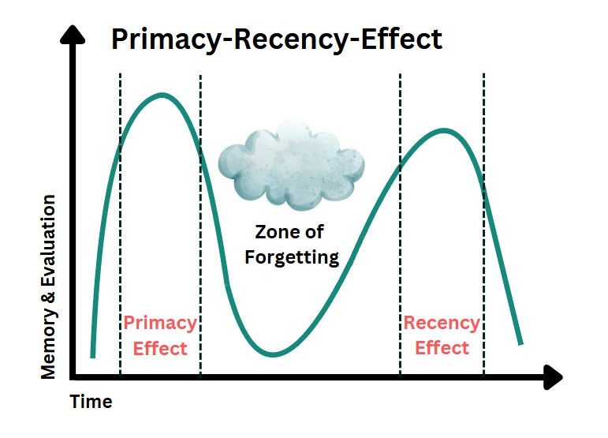

If you sit down to read a book over the course of two hours without taking any
breaks, you might remember the first 20 minutes of what you read, then maybe
you’ll experience a dip around the 30-minute mark, and then you’re likely to
remember the end of what you read. This means the lull in between, with no
breaks for assimilation or thinking through what you just read, results in a dead
space for learning. So, take this book one Pomodoro at a time so you get the
most out of what you read. If you still choose to cram, you’ll learn helpful
methods in the book to retain the “in-between” information.
Did you know that the very act of reading this book will make you smarter? I
realize that’s a big claim, but I’m completely convinced that it’s true. On one
level, it’s going to teach you to be smarter through the tools and tactics I share
here. But on another level, when you actively read it, you’ll form pictures in
your mind, and you’ll make connections between what you know and what
you’re learning. You will think about how this applies to your current life, and
you will imagine how you can use the knowledge you’re taking in. It promotes
neuroplasticity. Oliver Wendell Holmes said, “Every now and then a man’s
mind is stretched by a new idea or sensation, and never shrinks back to its
former dimensions.” When you read any book, you have the opportunity to
stretch the range of your mind, and it will never be the same.

> Kwik start

## Use the `FASTER` method

To get the most out of this book, here is a simple method for learning anything
quickly. I call it the FASTER Method, and I want you to use this as you read,
starting now.
The acronym FASTER stands for: Forget, Act, State, Teach, Enter, Review.
Here’s the breakdown:

## `F` is for Forget

The key to laser focus is to remove or forget that which distracts you. There are
three things you want to forget (at least temporarily). The first is what you
already know. When learning something new, we tend to assume we understand
more than we do about that subject. What we think we know about the topic can
stand in the way of our ability to absorb new information. One of the reasons
children learn rapidly is because they are empty vessels; they know they don’t
know. Some people who claim to have twenty years of experience have one year
of experience that they’ve repeated twenty times. To learn beyond your present
sense of restraints, I want you to temporarily suspend what you already know or
think you know about the topic and approach it with what Zen philosophy calls
“a beginner’s mind.” Remember that your mind is like a parachute—it only
works when it’s open.
The second thing is to forget what’s not urgent or important. Contrary to
popular belief, your brain doesn’t multitask (more on this later). If you’re not
fully present, it will be difficult for you to learn when your focus is split.

> Kwik start

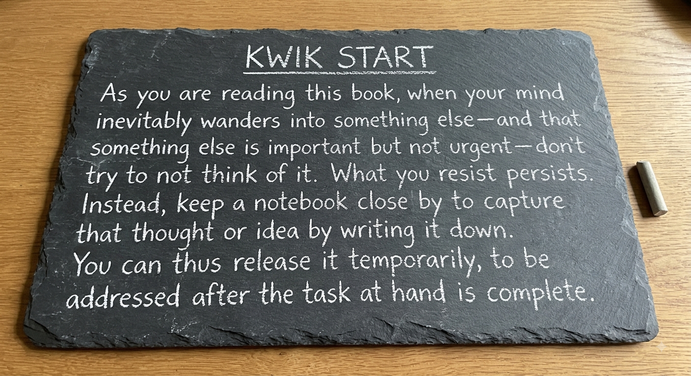

And finally, forget about your limitations. These are the preconceived notions
you believe about yourself, such as that your memory isn’t good or that you’re a
slow learner. Suspend (at least temporarily) what you believe is possible. I know
this may sound difficult but keep an open mind to what you can do. After all,
since you are reading this book, some part of you deep down must believe
there’s more to life than what you’ve already demonstrated. Do your best to keep
your self-talk positive. Remember this: If you fight for your limitations, you get
to keep them. Your capabilities aren’t fixed, and it’s possible to learn anything.

## `A` is for Act

Traditional education has trained many people that learning is a passive
experience. You sit quietly in class, you don’t talk to your neighbor, and you
consume the information. But learning is not a spectator sport. The human brain
does not learn as much by consumption as it does by creation. Knowing that, I
want you to ask yourself how you can become more active in your learning.
Take notes. Do all the Kwik Start exercises. Download the Kwik Brain app to
test and train your limitless abilities. Go to the resource page at www.LimitlessB
ook.com/resources for additional free tools. I recommend you highlight key
ideas, but don’t become one of those highlight junkies who make every page
glow in the dark. If you make everything important, then nothing becomes
important. The more active you are, the better, faster, and more you will learn.

> Kwik start

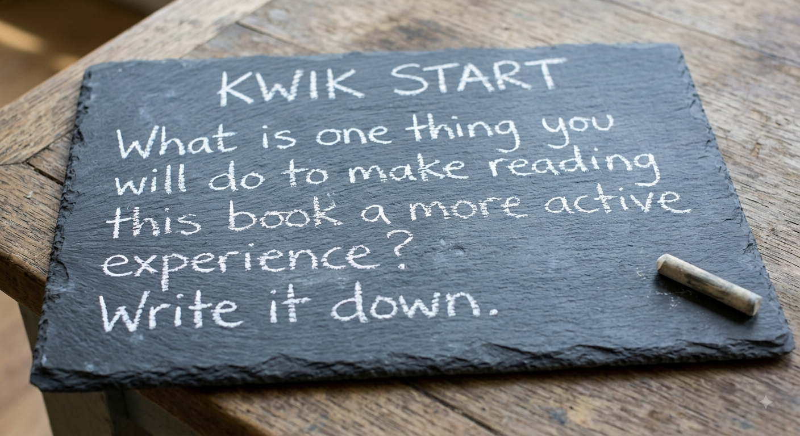

## S is for State

All learning is state-dependent. Your state is a current snapshot of your
emotions. It is highly influenced by your thoughts (psychology) and the physical condition of your body (physiology). Your feelings or lack thereof about a
subject in a specific situation affect the learning process and ultimately the
results. In fact, when you tie a feeling to information, the information becomes
more memorable. To prove this, I’m guessing there’s a song, fragrance, or food
that can take you back to your childhood. Information times emotion helps
create long-term memories. The opposite is also true. What was the predominant
emotional state you felt back in school? When I ask audiences this question,
most people in the room shout out “boredom!” In all likelihood, you can relate to
this.
If your emotional energy at school was low, it’s no wonder you forgot the
periodic table. But, when you take control of your state of mind and body, you
can shift your experience of learning from boredom to excitement, curiosity, and
even fun. To achieve this, you might try shifting the way your body moves in a
learning environment or piquing different moods before you sit down to learn.
Change your posture or the depth of your breathing. Sit or stand the way you
would if you were totally energized and excited for what was coming. Get
excited about how you will benefit from what you are about to learn and what
you will do with your new knowledge. Remember, all learning is state-
dependent. Consciously choose states of joy, fascination, and curiosity.

> Kwik start

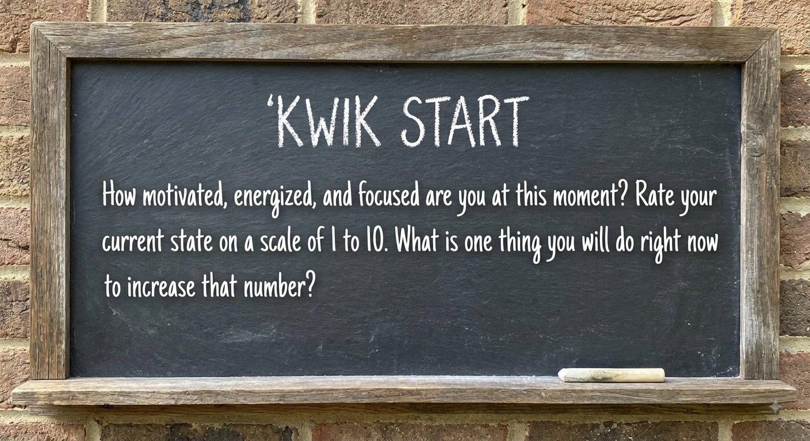

## T is for Teach

If you want to cut your learning curve dramatically, learn with the intention of
teaching the information to someone else. Think about it: If you know you have
to give a presentation on what you learn, you will approach how you learn the
topic with the intention of mastering it well enough to explain it to someone else.
You will pay closer attention. Your notes might be more detailed. And you
might even ask better questions. When you teach something, you get to learn it
twice: once on your own, and then again through educating another person.
Learning isn’t always solo; it can be social. You may enjoy this book more if
you invite someone else to learn with you. Buy a copy for a friend, or, even better, start a Limitless Book Club that meets weekly so you can discuss the
ideas and concepts in this book. You’ll enjoy learning more when you’re making
memories with a friend or group of friends. Working with someone else will not
only help you stay accountable, but it will give you someone to practice this
method with.

> Kwik start

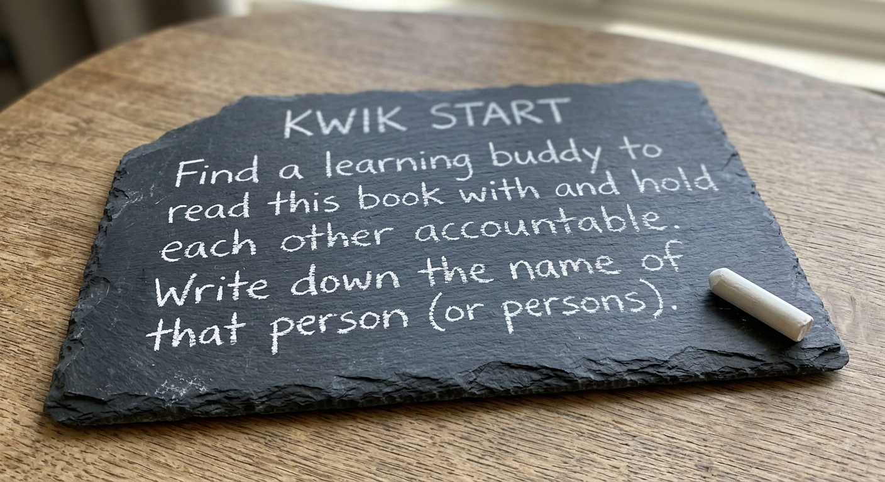

## E is for Enter

What is the simplest and most powerful personal performance tool? Your
calendar. We enter important things on our schedule: work meetings, parent-
teacher gatherings, dentist appointments, taking Fluffy to the vet, and so on. Do
you know what a lot of people don’t schedule? Their personal growth and
development. If it’s not on your calendar, there’s a good chance it’s not getting
done. It’s too easy for the day to slip by with you “forgetting” to work out your
body and brain.

> Kwik start

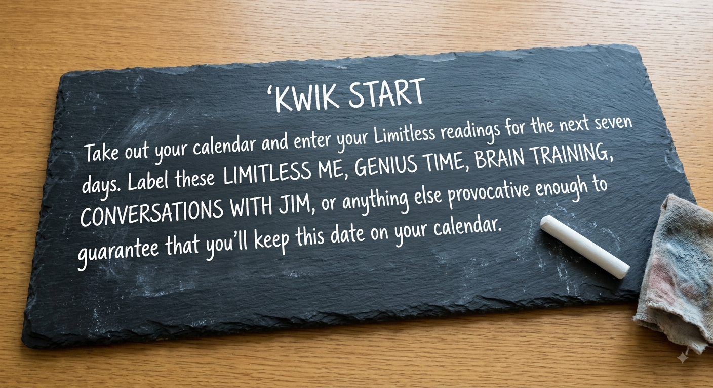

## R is for Review

One of the best ways to reduce the effects of the forgetting curve is to actively
recall what you learned with spaced repetition. You are better able to retain
information by reviewing in multiple spread-out sessions. Going over the
material at intervals increases our brain’s ability to remember it. To leverage this
principle, before you begin your reading session take a moment, if only a few
minutes, to actively retrieve what you learned the session before. Your brain will give greater value to the reviewed material and prime your mind for what’s to
come.

> Kwik start

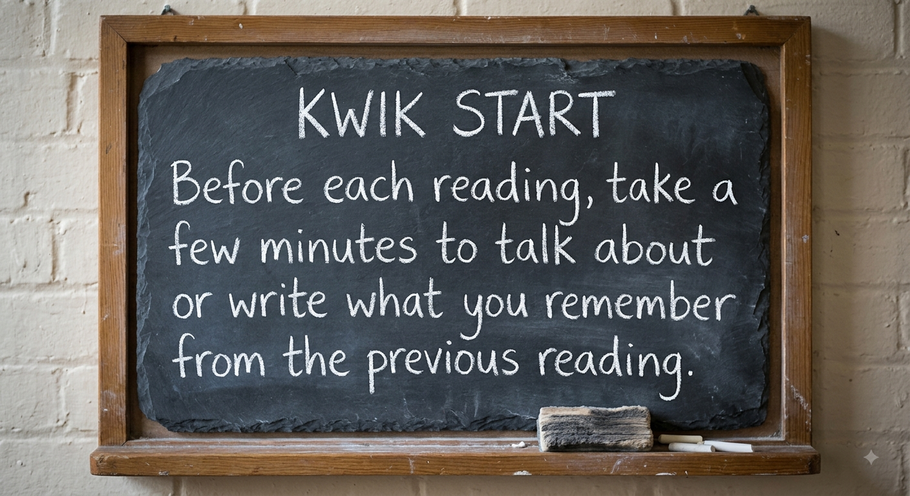

> [!TIP]
> I want you to write down your commitment to complete this book. When we write something down, we’re more likely to do what we promise

> [!TIP]
> Ask right question to you. Try **What I can do to solve this problem** instead **Why this problem with me?**

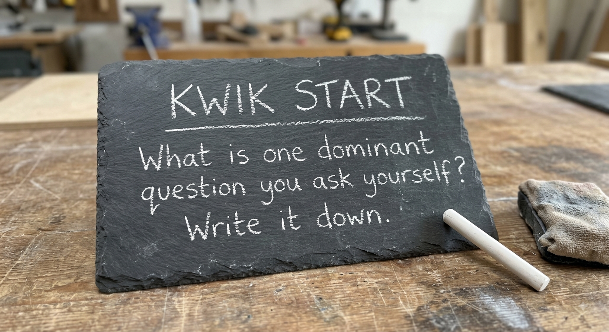

## Prepare your mind

Questions direct your focus, so they play into everything in life—even reading
comprehension. Because people typically don’t ask enough questions when they
read, they compromise their focus, understanding, and retention. If you prep
your mind with the right kinds of questions before you read, you’ll see answers
(pug dogs) everywhere. For that reason, I place specific key questions
throughout the book.
To start you off, here are the three dominant questions to ask on our journey
together. They will help you to take action on what you learn and turn the
knowledge into power.
- **How can I use this?**
- **Why must I use this?**
- **When will I use this?**

> Kwik start
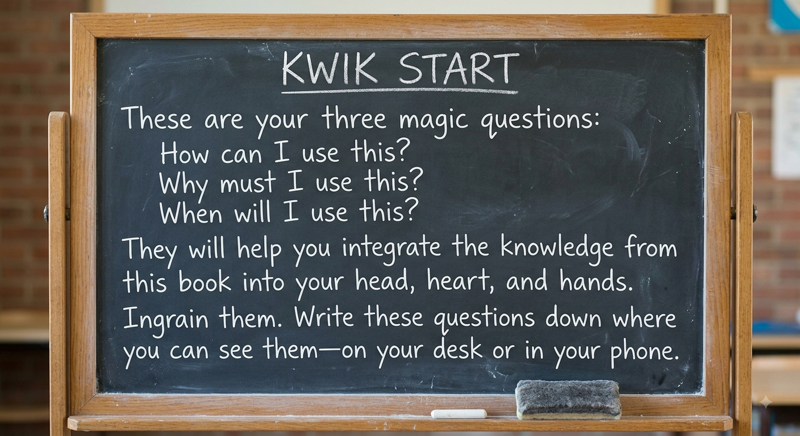

## Forms of genius

**Dynamo genius:** Those who express their genius through creativity and
ideas. Shakespeare was a dynamo genius because of his brilliance at
inventing stories that told us so much about ourselves. Galileo was a
dynamo genius because of the way he could see things that others couldn’t
see when he looked up at the skies. Dynamo geniuses are those we most commonly think of when we think of geniuses.

**Blaze genius:** Those whose genius becomes clear through their interaction
with others. Oprah Winfrey is a blaze genius because of her extraordinary
ability to connect with the hearts, minds, and souls of a wide range of
individuals. Malala Yousafzai’s blaze genius expresses itself through her
ability to make her story relatable to people all around the globe. Blaze
geniuses tend to be master communicators.

**Tempo genius:** Those whose genius expresses itself through their ability to
see the big picture and stay the course. Nelson Mandela was a tempo genius
because he was capable of seeing the wisdom of his vision even in the face
of overwhelming odds. Mother Teresa’s tempo genius allowed her to
imagine better circumstances for those around her even at the darkest times.
Tempo geniuses tend to understand the long view in ways that most of
those around them cannot.

**Steel genius:** Those who are brilliant at sweating the small stuff and doing
something with the details that others missed or couldn’t envision. Sergey
Brin used his genius at seeing the potential of large amounts of data to co-
found Google. If you read the book Moneyball, then you know that Billy
Beane and his staff redefined baseball through their genius at crunching
data. Steel geniuses love getting all the information they can get and have a
vision for doing something with that information that most others miss.

> Kwik start

How do you minimize limiting beliefs and develop a superhero mindset?
To me, there are three keys.
### Key 1: Name Your Limiting Beliefs

You’ve seen some examples here of limiting beliefs, but there are many more
where those came from (and we’ll go over the seven most prevalent limiting
beliefs on learning in a moment). They might have to do with your talents, your
character, your relationships, your education, or anything else that leads to
internal whispers that you can’t be what you want to be. Start paying attention
right now to every time you tell yourself that you’re incapable, even if you think
that this particular thing might not be consequential in your life.
For example, maybe you tell yourself that you’re terrible at telling jokes.
Perhaps this isn’t a big deal to you, because being a good joke-teller isn’t a
personal aspiration. But you might also be telling yourself that you don’t think
you’re entertaining, or good company, or an enjoyable companion; and that kind
of self-talk can ultimately cause you to double-clutch when you’re in an
important social situation or when you need to speak in front of a group. So,
listen carefully every time you find yourself using phrases like “I can’t,” “I’m
not,” or “I don’t.” You’re sending messages to yourself that are affecting how
you think about your life in general, even if what you’re beating yourself up over
is something specific and seemingly not important to how you define yourself.
At the same time, try also to identify the origin of this sort of self-talk.
Limiting beliefs often start in childhood. That doesn’t automatically mean that
your family is their only source. Early social settings can cause limiting beliefs,
as can early experiences with education. Some might take hold simply because
something didn’t go well for you the first few times you tried it as a kid.
Being aware of how you’re holding yourself back with your self-talk and
spending some time to get to the source of these beliefs is extremely liberating,
because once you’re aware, you can begin to realize that these aren’t facts about
you, but rather opinions. And there’s a very good chance that those opinions are
wrong.
Once you identify the voices in your head that are focusing on what you can’t
do, start talking back to them. When you find yourself thinking, “I always screw up this sort of thing,” counter with, “Just because I haven’t always been good at
this in the past doesn’t mean that I can’t be great at it now. Keep your opinions
to yourself.”

### Key 2: Get to the Facts

One of the fundamental tyrannies of limiting beliefs is that, in so many cases,
they’re just plain wrong. Are you really terrible at speaking in public? Are you
really bad at leading a group? Are you really the least interesting person in the
room wherever you are? What’s the evidence to support that? How many times
have you actually been in these situations, and what have the results been? One of the most pernicious things about limiting beliefs is that they play so
heavily on our emotions. When you come up against a limiting belief, you’re
likely to find those beliefs warring—and usually winning—against your rational
self. But how much of this self-talk has a basis in reality? Think about your
experiences speaking in public (an extraordinarily common fear, by the way).
Rather than focusing on how you felt in these instances, consider how things
went. Were you booed off the stage? Did people come up to you afterward to
laugh at you and tell you how awful you were? Did your boss sit you down the
next day to say that you might want to consider a career where you never had to
utter a word?
I’m guessing none of these things happened. Instead, it’s likely that your
audience felt connected to what you were saying. If it was in a professional
setting, maybe they were taking notes, and you almost certainly taught them
something. Does this mean that your next speech should be at TED? Of course
not. But it definitely means that you’re likely much better at conveying
information to a group than that voice in your head is telling you that you are.
And then there’s this question to ask: How much of my perceived poor
performance was because my self-talk just wouldn’t leave me alone? This is a
real issue for many people. They’ll be in the middle of doing something in which
they lack confidence, and the inner critic will become so distracting that they
can’t focus on what they are doing . . . and therefore don’t do it very well. This is
one of the reasons why it’s so important to learn to face down and quiet your
limiting beliefs. The better you are at this, the better you’ll be at keeping down
distractions during your biggest growth challenges.
So, when you’re examining the facts behind your limiting beliefs, be sure to
consider two things: whether there is in reality any evidence to prove that you
are truly hampered in this area and whether even that evidence was tainted by
the noise in your head.

### Key 3: Create a New Belief

Now that you’ve given your limiting beliefs a name and now that you’ve
carefully examined the reality of those beliefs, it’s time to take the most essential
step—to generate a new belief that is both truer than the LIEs you’ve been
accepting and beneficial to the limitless you that you are creating.
You’re going to see this process at work in the next chapter, but let’s take it
for a spin right now. Let’s say that one of your limiting beliefs is that you always
come up short at the most important moments in your life. Having identified that
as a limiting belief, you’ve then taken the step of examining the facts. What you realize is that, while you have occasionally succumbed to nervousness in
pressure-packed moments, very few of these instances have been disastrous for
you and, upon examination, you can think of several times when you “came
through in the clutch.” In fact, now that you really think about it, you’ve
succeeded way more often than you’ve faltered.
So, now it’s time to create a new belief. In this case, your new belief would be
that no one triumphs at the most critical juncture 100 percent of the time, but that
you should be proud of yourself for how many times you’ve performed at your
best when the pressure was highest. This new belief completely supplants the old
belief, is fully supported by the facts, and gives you a much healthier mindset the
next time a critical situation comes along.
I have one more tool for you to use here. I’ve spoken to many experts over the
years, and the conversation often comes back to the same thing: as long as you
believe that your inner critic is the voice of the true you, the wisest you, it’s
always going to guide you. Many of us even use phrases like, “I know myself,
and . . .” before announcing a limiting belief.
But if you can create a separate persona for your inner critic—one that is
different from the true you—you’ll be considerably more successful at quieting
it. This can be enormously helpful and you can have fun with it at the same time.
Give your inner critic a preposterous name and outrageous physical attributes.
Make it cartoonish and unworthy of even a B-grade movie. Mock it for its rigid
dedication to negativity. Roll your eyes when it pops into your head. The better
you become at distinguishing this voice from the real you, the better you’ll be at
preventing limiting beliefs from getting in your way.

> [!TIP]
> Maybe you say to
yourself, “I’m not good at reading.” This kind of statement implies that you
believe this is a fixed situation and that your skills can’t be improved. Instead,
try saying something like “This is something I’m not good at yet.” This shift in
language can be applied to anything you want to improve.

# 7 Lies of learning

1. **Inteligence is fixed**
    - **The lie:** You are born with a set, unchangeable level of intelligence.
    - **The truth:** Intelligence is fluid. By adopting a growth mindset, exploring new methods, and practicing consistently, you can continually expand your cognitive capabilities
2. **We only use 10% of our brains**
    - **The lie:** The vast majority of our brain's potential remains completely dormant and untapped.
    - **The truth:** Brain mapping has shown that we use all of our brain. The goal is not unlocking hidden percentages of the brain, but rather learning to use your whole brain more efficiently.
3. **Mistakes are failure**
    - **The lie:** Getting something wrong means you are incapable or have failed.
    - **The truth:** Mistakes are stepping stones and a critical part of the learning process. There is no real failure—only a failure to learn from the attempt.
4. **Knowledge is power**
    - **The lie:** Simply acquiring information and hoarding facts makes you powerful.
    - **The truth:** Knowledge only holds the potential for power. It becomes true power only when it is applied. Kwik frames this as an equation: *Knowledge x Action = Power*.
5. **Learning new things is very difficult**
    - **The lie:** Expanding your skills or mastering new subjects is inherently grueling and painful.
    - **The truth:** Learning is simply a set of methods. Once you discover the techniques that align with how your specific brain works, the process of learning becomes faster, easier, and much more enjoyable.
6. **The criticism of other people matter**
    - **The lie:** Your self-worth, choices, and potential should be dictated by the opinions of others.
    - **The truth:** External judgments do not define your capabilities. If you let the fear of criticism run your life, you will never take the risks necessary to discover your true potential. 
7. **Genius is born**
    - **The lie:** World-class talent and genius are reserved for a lucky few who inherit them at birth.
    - **The truth:** Greatness is not born; it is grown. Genius is developed through deep practice, consistency, and relentless dedication over time.
> Kwik start

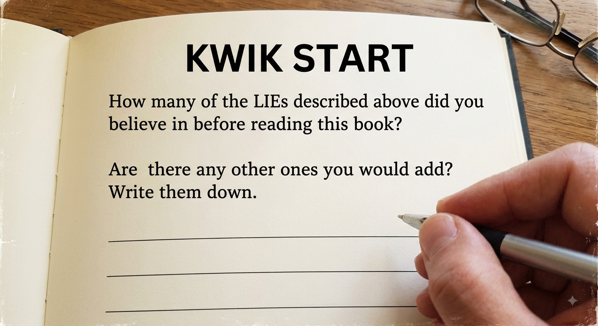

# START WITH WHY

Among my favorite books is Start with Why by Simon Sinek, who I’ve interviewed multiple times on my show. He often stresses the importance of
being able to convey to others why you do what you do. If, Sinek explains, you
can articulate the belief that is driving you (your why), people will want what
you are offering. Or, as he so often says: “People don’t buy what you do, they
buy why you do it, so it follows that if you don’t know why you do what you do,
how will anyone else?”
There’s a reason why the second of the magic questions is, “Why must I use
this?” (Do you recall the other two questions?) For most children, their favorite
word is why, which they’re asking all the time. Do you know why it was
important to memorize the periodic table or historic dates? If you don’t, you
probably don’t remember them. We hear the words purpose and goals used
frequently in business, but do we really know what they mean and how they are
the same or different? A goal is the point one wishes to achieve. A purpose is the
reason one aims at to achieve a goal.
Whether your goal is to read a book a week, learn another language, get in
shape, or just leave the office on time to see your family, these are all things that
you need to achieve. But how do you do this? One of the popular ways is setting
SMART goals. Yes, this is an acronym:

**S is for Specific:** Your goal should be well defined. Don’t say you want to
be rich; say you want to make a certain amount of money.
**M is for Measurable:** If you can’t measure your goal, you can’t manage it.
Getting fit isn’t measurable—running a six-minute mile is.
**A is for Actionable:** You wouldn’t drive to a new town without asking for
directions. Develop the action steps to achieve your goal.
**R is for Realistic:** If you’re living in your parents’ basement, it’s hard to
become a millionaire. Your goals should challenge and stretch you, but not
so much that you give up on them.
**T is for Time-based:** The phrase, “A goal is a dream with a deadline”
comes to mind. Setting a time to complete your goal makes you that much
more likely to reach it.
The challenge for many people is that this process, while logical, is very
heady. To get your goals out of your head and into your hands, make sure they
fit with your emotions—with your HEART:

**H is for Healthy:** How can you make sure your goals support your greater well-being? Your goals should contribute to your mental, physical, and
emotional health.
**E is for Enduring:** Your goals should inspire and sustain you during the
difficult times when you want to quit.
A is for Alluring: You shouldn’t always have to push yourself to work on
your goals. They should be so exciting, enticing, and engaging that you’re
pulled toward them.
**R is for Relevant:** Don’t set a goal without knowing why you’re setting it.
Ideally, your goals should relate to a challenge you’re having, your life’s
purpose, or your core values.
**T is for Truth:** Don’t set a goal just because your neighbor is doing it or
your parents expect it of you. Make sure your goal is something you want,
something that remains true to you. If your goal isn’t true to you, you’re far
more likely to procrastinate and sabotage yourself.
